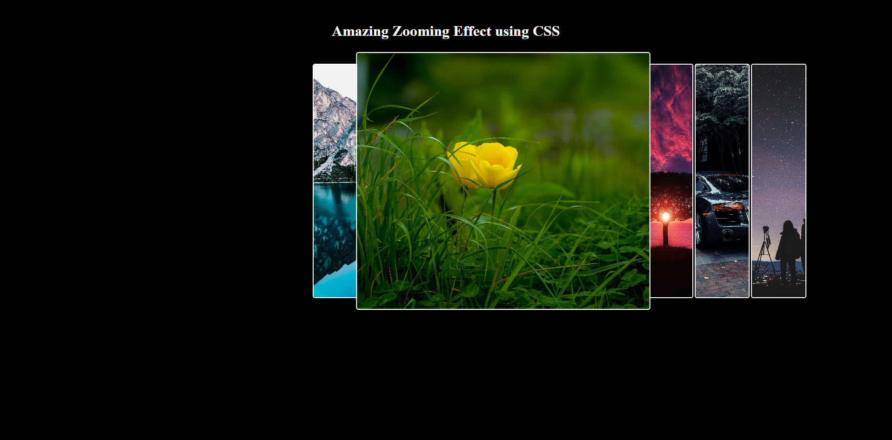
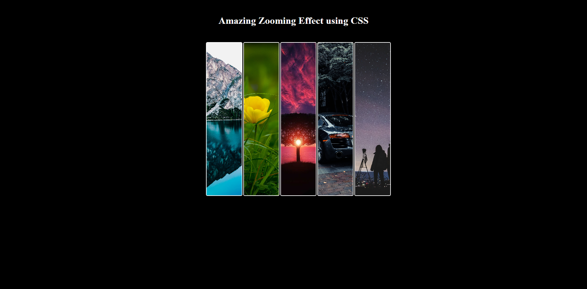

# Zooming Effect Using CSS

This repository showcases an amazing zooming effect implemented purely with CSS. The effect is applied to a gallery of images, creating an engaging visual experience.

## Overview

The HTML file (`index.html`) contains a simple structure with a heading and a gallery of images. The main focus is on the CSS file (`style.css`), where the zooming effect is achieved. This project serves as a demonstration of how CSS can be leveraged to enhance the user experience through creative visual effects.

## Preview

## Usage

1. Clone or download the repository to your local machine.
2. Open the `index.html` file in a web browser.
3. Experience the captivating zooming effect on the image gallery.

## Features

- **Zooming Effect:** The CSS file includes styles to create a zoom-in effect when hovering over the gallery images.
- **Responsive Design:** The layout is designed to be responsive, ensuring a seamless experience on various devices.

## Contributing

If you want to contribute to this project, feel free to submit a pull request. Your contributions and feedback are highly appreciated!

## License

This project is licensed under the [MIT License](LICENSE). You are free to use and modify the code according to the terms specified in the license.

## Acknowledgments

- The project uses HTML for the structure and CSS for styling to achieve the zooming effect.
- Inspiration for this project comes from the creative use of CSS for enhancing user interfaces.

Feel free to explore the code and experiment with the zooming effect. If you have any questions or suggestions, don't hesitate to open an issue or a pull request.

Enjoy the amazing zooming effect!
